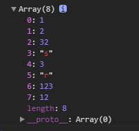

# 数组去重

## 利用es6的set

ES6提供了新的数据结构Set。它类似于数组，但是成员的值都是唯一的，没有重复的值。

```js
var arr=[1,2,32,1,'s',3,'r',123,12,2,1,123];
var arr2=[...new Set(arr)]
console.log(arr2) 
```


`[...arr]`展开运算符，把set格式的变成array格式

## 利用filter

过滤掉当前索引在前面出现过的元素

```js
var arr=[1,2,32,1,'s',3,'r',123,12,2,1,123];
var arr1=arr.filter((e,l,arr)=>{
	return l==arr.indexOf(e)
});
console.log(arr1)
``` 

